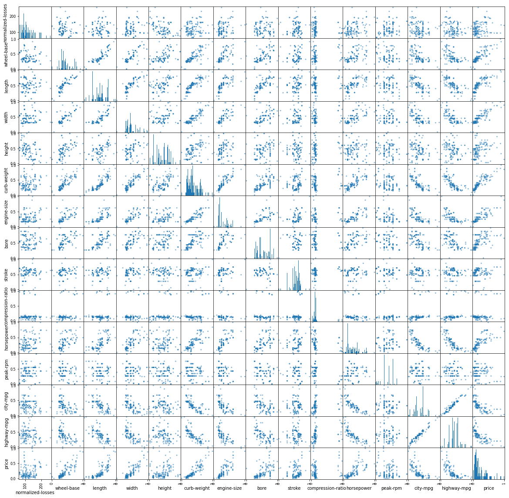
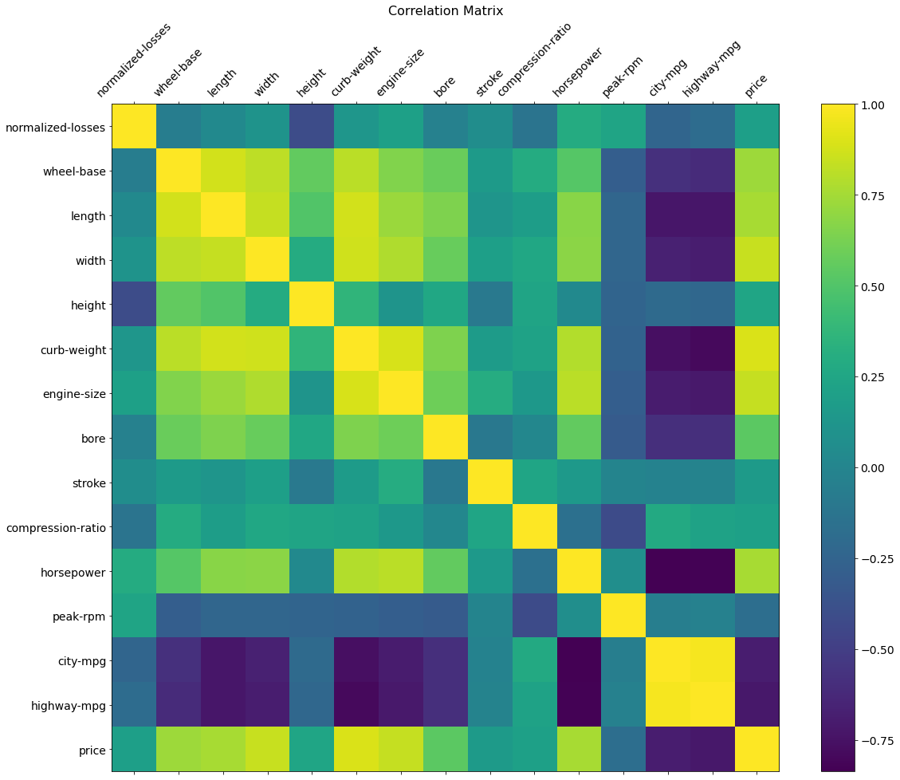
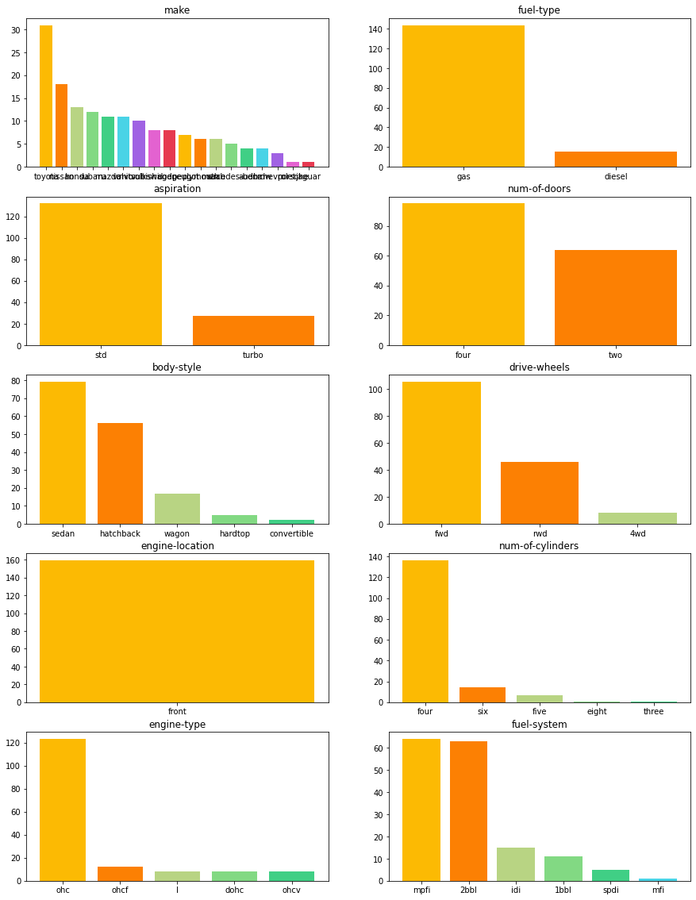
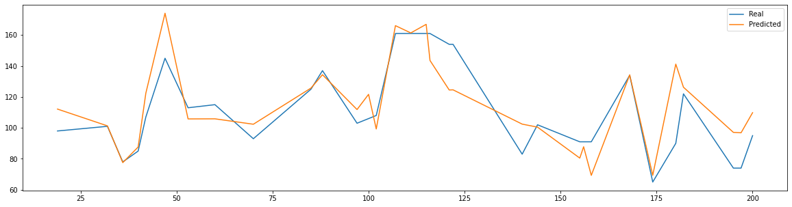
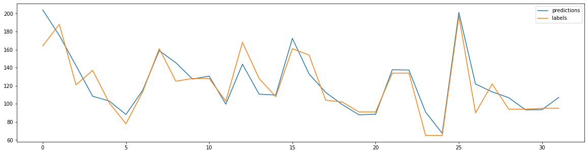

# Automobile data full analysis

This notebook is a simple data analysis for the Automobile dataset provided at 
https://archive.ics.uci.edu/ml/datasets/Automobile.

A full data description can be found at https://archive.ics.uci.edu/ml/machine-learning-databases/autos/imports-85.names

## 1) Analysis Description

**Problem type**:  Regression

**Prediction Target**: normalized-losses

**Data Format**: Headerless CSV

**Missing Values Symbole**: "?"

**Features to Ignore**: 'symboling'

**Used Loss**: mean squared error (MSE)

**Used Machine Learning Algorithms**: Normal Equations, Deep Learning


## 2) Importing necessary libraries


```python
import pandas as pd
import matplotlib.pyplot as plt
import tensorflow as tf
from tensorflow.keras import Model
from tensorflow.keras.layers import Dense
import numpy as np
import os 
```


```python
# We set seeds for reproduciability

tf.random.set_seed(1)
np.random.seed(1)
```

## 3) Data Loading


```python
url = 'https://archive.ics.uci.edu/ml/machine-learning-databases/autos/imports-85.data'
# download the data from given URL and with given columns
columns = ['symbolying','normalized-losses', 'make', 'fuel-type', 'aspiration', 'num-of-doors', 'body-style', 'drive-wheels', 'engine-location'
        ,'wheel-base', 'length', 'width', 'height', 'curb-weight', 'engine-type', 'num-of-cylinders', 'engine-size', 'fuel-system'
        ,'bore', 'stroke', 'compression-ratio', 'horsepower', 'peak-rpm', 'city-mpg', 'highway-mpg', 'price']

#loading the dataset using pandas and replacing "?" with NA values
raw_data = pd.read_csv(url,names=columns,na_values="?")

#We ignore 'symboling' column
raw_data.pop('symbolying')
raw_data.head()
```


<div>
<style scoped>
    .dataframe tbody tr th:only-of-type {
        vertical-align: middle;
    }

    .dataframe tbody tr th {
        vertical-align: top;
    }

    .dataframe thead th {
        text-align: right;
    }
</style>
<table border="1" class="dataframe">
  <thead>
    <tr style="text-align: right;">
      <th></th>
      <th>normalized-losses</th>
      <th>make</th>
      <th>fuel-type</th>
      <th>aspiration</th>
      <th>num-of-doors</th>
      <th>body-style</th>
      <th>drive-wheels</th>
      <th>engine-location</th>
      <th>wheel-base</th>
      <th>length</th>
      <th>...</th>
      <th>engine-size</th>
      <th>fuel-system</th>
      <th>bore</th>
      <th>stroke</th>
      <th>compression-ratio</th>
      <th>horsepower</th>
      <th>peak-rpm</th>
      <th>city-mpg</th>
      <th>highway-mpg</th>
      <th>price</th>
    </tr>
  </thead>
  <tbody>
    <tr>
      <th>0</th>
      <td>NaN</td>
      <td>alfa-romero</td>
      <td>gas</td>
      <td>std</td>
      <td>two</td>
      <td>convertible</td>
      <td>rwd</td>
      <td>front</td>
      <td>88.6</td>
      <td>168.8</td>
      <td>...</td>
      <td>130</td>
      <td>mpfi</td>
      <td>3.47</td>
      <td>2.68</td>
      <td>9.0</td>
      <td>111.0</td>
      <td>5000.0</td>
      <td>21</td>
      <td>27</td>
      <td>13495.0</td>
    </tr>
    <tr>
      <th>1</th>
      <td>NaN</td>
      <td>alfa-romero</td>
      <td>gas</td>
      <td>std</td>
      <td>two</td>
      <td>convertible</td>
      <td>rwd</td>
      <td>front</td>
      <td>88.6</td>
      <td>168.8</td>
      <td>...</td>
      <td>130</td>
      <td>mpfi</td>
      <td>3.47</td>
      <td>2.68</td>
      <td>9.0</td>
      <td>111.0</td>
      <td>5000.0</td>
      <td>21</td>
      <td>27</td>
      <td>16500.0</td>
    </tr>
    <tr>
      <th>2</th>
      <td>NaN</td>
      <td>alfa-romero</td>
      <td>gas</td>
      <td>std</td>
      <td>two</td>
      <td>hatchback</td>
      <td>rwd</td>
      <td>front</td>
      <td>94.5</td>
      <td>171.2</td>
      <td>...</td>
      <td>152</td>
      <td>mpfi</td>
      <td>2.68</td>
      <td>3.47</td>
      <td>9.0</td>
      <td>154.0</td>
      <td>5000.0</td>
      <td>19</td>
      <td>26</td>
      <td>16500.0</td>
    </tr>
    <tr>
      <th>3</th>
      <td>164.0</td>
      <td>audi</td>
      <td>gas</td>
      <td>std</td>
      <td>four</td>
      <td>sedan</td>
      <td>fwd</td>
      <td>front</td>
      <td>99.8</td>
      <td>176.6</td>
      <td>...</td>
      <td>109</td>
      <td>mpfi</td>
      <td>3.19</td>
      <td>3.40</td>
      <td>10.0</td>
      <td>102.0</td>
      <td>5500.0</td>
      <td>24</td>
      <td>30</td>
      <td>13950.0</td>
    </tr>
    <tr>
      <th>4</th>
      <td>164.0</td>
      <td>audi</td>
      <td>gas</td>
      <td>std</td>
      <td>four</td>
      <td>sedan</td>
      <td>4wd</td>
      <td>front</td>
      <td>99.4</td>
      <td>176.6</td>
      <td>...</td>
      <td>136</td>
      <td>mpfi</td>
      <td>3.19</td>
      <td>3.40</td>
      <td>8.0</td>
      <td>115.0</td>
      <td>5500.0</td>
      <td>18</td>
      <td>22</td>
      <td>17450.0</td>
    </tr>
  </tbody>
</table>
<p>5 rows × 25 columns</p>
</div>


## 3) Handling Missing Values


```python
#we check NA values 
raw_data.isna().sum()
```


    normalized-losses    41
    make                  0
    fuel-type             0
    aspiration            0
    num-of-doors          2
    body-style            0
    drive-wheels          0
    engine-location       0
    wheel-base            0
    length                0
    width                 0
    height                0
    curb-weight           0
    engine-type           0
    num-of-cylinders      0
    engine-size           0
    fuel-system           0
    bore                  4
    stroke                4
    compression-ratio     0
    horsepower            2
    peak-rpm              2
    city-mpg              0
    highway-mpg           0
    price                 4
    dtype: int64


<font color='green'>**Observation** </font>: most of missing values are 'normalized loss' values which is our prediction target. Normally we drop rows only with missing values in the prediction target. However, the data is too small and filling input features missing values with median, mean or 0 might harm the generalization to test data. It is better to drop all rows with missing values instead.


```python
dataset = raw_data.dropna().copy()
```

## 4) Statistics


```python
# general statistics over quantitative values
dataset.describe().transpose()
```


<div>
<style scoped>
    .dataframe tbody tr th:only-of-type {
        vertical-align: middle;
    }

    .dataframe tbody tr th {
        vertical-align: top;
    }

    .dataframe thead th {
        text-align: right;
    }
</style>
<table border="1" class="dataframe">
  <thead>
    <tr style="text-align: right;">
      <th></th>
      <th>count</th>
      <th>mean</th>
      <th>std</th>
      <th>min</th>
      <th>25%</th>
      <th>50%</th>
      <th>75%</th>
      <th>max</th>
    </tr>
  </thead>
  <tbody>
    <tr>
      <th>normalized-losses</th>
      <td>159.0</td>
      <td>121.132075</td>
      <td>35.651285</td>
      <td>65.00</td>
      <td>94.000</td>
      <td>113.00</td>
      <td>148.00</td>
      <td>256.00</td>
    </tr>
    <tr>
      <th>wheel-base</th>
      <td>159.0</td>
      <td>98.264151</td>
      <td>5.167416</td>
      <td>86.60</td>
      <td>94.500</td>
      <td>96.90</td>
      <td>100.80</td>
      <td>115.60</td>
    </tr>
    <tr>
      <th>length</th>
      <td>159.0</td>
      <td>172.413836</td>
      <td>11.523177</td>
      <td>141.10</td>
      <td>165.650</td>
      <td>172.40</td>
      <td>177.80</td>
      <td>202.60</td>
    </tr>
    <tr>
      <th>width</th>
      <td>159.0</td>
      <td>65.607547</td>
      <td>1.947883</td>
      <td>60.30</td>
      <td>64.000</td>
      <td>65.40</td>
      <td>66.50</td>
      <td>71.70</td>
    </tr>
    <tr>
      <th>height</th>
      <td>159.0</td>
      <td>53.899371</td>
      <td>2.268761</td>
      <td>49.40</td>
      <td>52.250</td>
      <td>54.10</td>
      <td>55.50</td>
      <td>59.80</td>
    </tr>
    <tr>
      <th>curb-weight</th>
      <td>159.0</td>
      <td>2461.138365</td>
      <td>481.941321</td>
      <td>1488.00</td>
      <td>2065.500</td>
      <td>2340.00</td>
      <td>2809.50</td>
      <td>4066.00</td>
    </tr>
    <tr>
      <th>engine-size</th>
      <td>159.0</td>
      <td>119.226415</td>
      <td>30.460791</td>
      <td>61.00</td>
      <td>97.000</td>
      <td>110.00</td>
      <td>135.00</td>
      <td>258.00</td>
    </tr>
    <tr>
      <th>bore</th>
      <td>159.0</td>
      <td>3.300126</td>
      <td>0.267336</td>
      <td>2.54</td>
      <td>3.050</td>
      <td>3.27</td>
      <td>3.56</td>
      <td>3.94</td>
    </tr>
    <tr>
      <th>stroke</th>
      <td>159.0</td>
      <td>3.236352</td>
      <td>0.294888</td>
      <td>2.07</td>
      <td>3.105</td>
      <td>3.27</td>
      <td>3.41</td>
      <td>4.17</td>
    </tr>
    <tr>
      <th>compression-ratio</th>
      <td>159.0</td>
      <td>10.161132</td>
      <td>3.889475</td>
      <td>7.00</td>
      <td>8.700</td>
      <td>9.00</td>
      <td>9.40</td>
      <td>23.00</td>
    </tr>
    <tr>
      <th>horsepower</th>
      <td>159.0</td>
      <td>95.836478</td>
      <td>30.718583</td>
      <td>48.00</td>
      <td>69.000</td>
      <td>88.00</td>
      <td>114.00</td>
      <td>200.00</td>
    </tr>
    <tr>
      <th>peak-rpm</th>
      <td>159.0</td>
      <td>5113.836478</td>
      <td>465.754864</td>
      <td>4150.00</td>
      <td>4800.000</td>
      <td>5200.00</td>
      <td>5500.00</td>
      <td>6600.00</td>
    </tr>
    <tr>
      <th>city-mpg</th>
      <td>159.0</td>
      <td>26.522013</td>
      <td>6.097142</td>
      <td>15.00</td>
      <td>23.000</td>
      <td>26.00</td>
      <td>31.00</td>
      <td>49.00</td>
    </tr>
    <tr>
      <th>highway-mpg</th>
      <td>159.0</td>
      <td>32.081761</td>
      <td>6.459189</td>
      <td>18.00</td>
      <td>28.000</td>
      <td>32.00</td>
      <td>37.00</td>
      <td>54.00</td>
    </tr>
    <tr>
      <th>price</th>
      <td>159.0</td>
      <td>11445.729560</td>
      <td>5877.856195</td>
      <td>5118.00</td>
      <td>7372.000</td>
      <td>9233.00</td>
      <td>14719.50</td>
      <td>35056.00</td>
    </tr>
  </tbody>
</table>
</div>


<font color='green'>**Observation** </font>: We can see that the quantitative values are in different ranges. Although this has no effect when we use normal equations, it is expected to prevent or delay the convergence when we use neural networks. Therefore we perform a Min-Max normalization over quantitative input features


```python
#first we make a copy of un normalized dataset to use it later with the normal equation model
unnormed_dataset = dataset.copy()
# we perform min-max normalization as the following
norm_data = dataset.loc[:,["wheel-base","length","width","height","curb-weight","engine-size","bore","stroke","compression-ratio","horsepower","peak-rpm","city-mpg","highway-mpg","price"]].copy()
norm_data_mins = norm_data.min()
norm_data_maxs = norm_data.max()
normalized_features =(norm_data-norm_data_mins)/(norm_data_maxs -  norm_data_mins)
dataset.loc[:,["wheel-base","length","width","height","curb-weight","engine-size","bore","stroke","compression-ratio","horsepower","peak-rpm","city-mpg","highway-mpg","price"]] = normalized_features.loc[:,["wheel-base","length","width","height","curb-weight","engine-size","bore","stroke","compression-ratio","horsepower","peak-rpm","city-mpg","highway-mpg","price"]]
```


```python
# Now we can generate a scatter plot for quantitative values
pd.plotting.scatter_matrix(dataset.drop(columns=["make","fuel-type","aspiration","num-of-doors","body-style","drive-wheels"
                                ,"engine-location","num-of-cylinders","engine-type","fuel-system"]),
                           hist_kwds={'bins': 100},figsize=(20,20));
```


    

    


<font color='green'>**Observation** </font>: 
* We can observe the existance of outliers in the prediction target (normalized-losses). which might indicate that using a mean absolute error (MAE) might be better than using a mean squared error (MSE) loss function.<font color='red'> However, it was required to use MSE for this task so we will go with it</font>.

* We also observe a weak correlation between the target and features except with the 'hight' feature where we can see a relativly stronger negative correlation.*
* "highway-mpg" and "city-mpg" are highly correlated features, we might need to break this correlation.


```python
# Let's confirm by plotting the correlation matrix
f = plt.figure(figsize=(19, 15))
plt.matshow(dataset.corr(), fignum=f.number)
plt.xticks(range(dataset.select_dtypes(['number']).shape[1]), dataset.select_dtypes(['number']).columns, fontsize=14, rotation=45)
plt.yticks(range(dataset.select_dtypes(['number']).shape[1]), dataset.select_dtypes(['number']).columns, fontsize=14)
cb = plt.colorbar()
cb.ax.tick_params(labelsize=14)
plt.title('Correlation Matrix', fontsize=16);
```


    

    


<font color='green'>**Observation** </font>:  Normally we would merge "city-mpg" and "highway-mpg" since they are highly correlated. but test results showed that they are better kept separate. 

## 5) Handling Categorical Features

First, we check the state of class counts per categorical feature


```python
fig_colors = ["#fcba03","#fc8003","#b8d483","#82d983","#40cf85","#49d3e6", "#a062e3", "#e362d0","#e63950"]
fig, axs = plt.subplots(5, 2,figsize=(15,20))
category_features = ["make","fuel-type","aspiration","num-of-doors","body-style","drive-wheels"
                                ,"engine-location","num-of-cylinders","engine-type","fuel-system"]
for i,column_name in enumerate(category_features):
    axs[int(i/2),i%2].set_title(column_name)
    axs[int(i/2),i%2].bar(dataset[column_name].value_counts().keys(),dataset[column_name].value_counts(),color=fig_colors)
```


    

    


<font color='green'>**Observation** </font>:  We can see that classes per each categorical feature are highly imbalanced. Unfortunately, the data is not large enough to fix the imbalance is a smart way. and ***fixing it with a naive approach (replicating minority classes) did not help much***

***Now we assign a one-hot encoding for eatch categorical feature***


```python
dataset = pd.get_dummies(dataset,columns=["num-of-cylinders","num-of-doors","make","fuel-type","aspiration","body-style","drive-wheels"
                        ,"engine-location","engine-type","fuel-system"],
                        prefix=["num-of-cylinders","num-of-doors","make","fuel-type","aspiration","body-style","drive-wheels"
                        ,"engine-location","engine-type","fuel-system"],prefix_sep='_')

unnormed_dataset = pd.get_dummies(unnormed_dataset,columns=["num-of-cylinders","num-of-doors","make","fuel-type","aspiration","body-style","drive-wheels"
                        ,"engine-location","engine-type","fuel-system"],
                        prefix=["num-of-cylinders","num-of-doors","make","fuel-type","aspiration","body-style","drive-wheels"
                        ,"engine-location","engine-type","fuel-system"],prefix_sep='_')
```

## 6) Target Prediction 

### a) Using Normal Equations

A normal equation solution is great for problems with such datasets with small number of features and examples

First, let's devide train and test sets. We ignore validation set due to small number of examples


```python
# We set 80% of the available data for training and the rest for testing
train_dataset = unnormed_dataset.sample(frac = 0.8, random_state=0)
test_dataset = unnormed_dataset.drop(train_dataset.index)

train_features = train_dataset.copy()
test_features = test_dataset.copy()

train_labels = train_features.pop('normalized-losses')
test_labels = test_features.pop('normalized-losses')
```

<font color='green'>**Observation and a trick** </font>: since our target variable is always positive, we can log scale it and exponentiate after prediction. it works well with regression models.


```python
log_labels = np.log(train_labels)
```


```python
#first we get the identity matrix
identity_size = train_features.shape[1]
identity_matrix= np.zeros((identity_size, identity_size))
np.fill_diagonal(identity_matrix, 1)

# we set a regularization parameter labmda to 1
lamb = 1
xTx = train_features.T.dot(train_features) + lamb * identity_matrix
xTx_inv = np.linalg.inv(xTx)
xTx_inv_xT = xTx_inv.dot(train_features.T)
theta = xTx_inv_xT.dot(log_labels)

```

Okay, now since we have our *theta* lets test our model

<font color='red'>**Remember** </font>: since we took the log of the lables, we must exponentiate after each prediction


```python

prediction = np.exp(test_features.dot(theta))
mse = (np.square(prediction - test_labels)).mean()
percentage = np.mean(np.abs(prediction - test_labels)/(test_labels))
print("mean squared error is {} and the percentage is {}".format(mse,percentage))
```

    mean squared error is 278.9966471058905 and the percentage is 0.11754073924291711
    

<font color='red'>**Results** </font>: **Our normal equation model achieved a mean squared error of 279.0 (16.67 RMSE) and a percentage Error of 11.75%.**

Let's plot the predicted vs real labels of the test dataset


```python
plt.rcParams["figure.figsize"] = (20,5)
plt.plot(test_labels)
plt.plot(prediction)
plt.legend(["Real","Predicted"])
plt.show()
```


    

    


### b) Using Neural Networks

Although deep neural network are extremly powerfull we do not expect to take advantage of that power due to small sample size. 


```python
# We set 80% of the available data for training and the rest for testing
train_dataset = dataset.sample(frac = 0.8, random_state=1)
test_dataset = dataset.drop(train_dataset.index)

train_features = train_dataset.copy()
test_features = test_dataset.copy()

train_labels = train_features.pop('normalized-losses')
test_labels = test_features.pop('normalized-losses')
# Working with such small dataset, it is better to train the model sample by sample for it to converge quickly
batch_size = 1
train_ds = tf.data.Dataset.from_tensor_slices((np.array(train_features),np.log(np.array(train_labels)))).batch(batch_size)
test_ds = tf.data.Dataset.from_tensor_slices((np.array(test_features),np.log(np.array(test_labels)))).batch(batch_size)
```

Now, we define a simple 3 hidden layers deep neural network model with relu activation functions.


```python
class Regression_Model(Model):

    def __init__(self):
        super(Regression_Model,self).__init__()
        self.dense1 = Dense(64, activation='relu' )
        self.dense2 = Dense(32, activation='relu' )
        self.dense3 = Dense(16, activation='relu' )
        self.final = Dense(1)


    def call(self,x):
        x = self.dense1(x)
        x = self.dense2(x)
        x = self.dense3(x)
        return self.final(x)

```

After that, let's define a Trainer class that incapsulates all out training related operations


```python
class Trainer:

    def __init__(self):
        self.model:Regression_Model = Regression_Model()
        
        self.loss = self.get_loss()
        self.optimizer = self.get_optimizer("SGD")
        self.train_loss = tf.keras.metrics.Mean(name='train_loss')
        self.test_loss = tf.keras.metrics.Mean(name='test_loss')


    def get_optimizer(self,opt="adam"):
        lr_schedule = tf.keras.optimizers.schedules.InverseTimeDecay(0.1,decay_steps=10000,decay_rate=1,staircase=False)
        if opt == 'adam':
            return tf.keras.optimizers.Adam(0.001)
        elif opt == 'SGD':
            return tf.keras.optimizers.SGD(lr_schedule)
        else:
            raise "This optimizer does not exist"

    def get_loss(self,loss='MSE'):
        if loss == 'MSE':
            return tf.keras.losses.MSE
        if loss == 'MAE':
            return tf.keras.losses.MAE
        else:
            raise "error"
    def predict(self,features):
        return self.model.predict(features)

    @tf.function
    def train_step(self,features,values):
        with tf.GradientTape() as tape:
            predictions = self.model(features,training = True)
            loss = self.loss(values,predictions)
            gradients = tape.gradient(loss,self.model.trainable_variables)
            self.optimizer.apply_gradients(zip(gradients,self.model.trainable_variables))
            self.train_loss(loss)
    
    @tf.function
    def test_step(self,features,values):
        predictions = self.model(features,training=False)
        loss = self.loss(values,predictions)
        self.test_loss(loss)

    def train(self):
        
        for epoch in range(100):
            self.train_loss.reset_states()
            self.test_loss.reset_states()

            for features,values in train_ds:
                self.train_step(features,values)

            for features,values in test_ds:
                self.test_step(features,values)
            
            print(
                f'Epoch {epoch + 1}, '
                f'Loss: {self.train_loss.result()}, '
                f'Test Loss: {self.test_loss.result()}, '
            )
        
```


```python
# Now we reset the random seeds for reproduciability and start the training!
os.environ['PYTHONHASHSEED']=str(1)
tf.random.set_seed(1)
np.random.seed(1)
trainer = Trainer()
trainer.train()
```

    WARNING:tensorflow:Layer regression__model_10 is casting an input tensor from dtype float64 to the layer's dtype of float32, which is new behavior in TensorFlow 2.  The layer has dtype float32 because its dtype defaults to floatx.
    
    If you intended to run this layer in float32, you can safely ignore this warning. If in doubt, this warning is likely only an issue if you are porting a TensorFlow 1.X model to TensorFlow 2.
    
    To change all layers to have dtype float64 by default, call `tf.keras.backend.set_floatx('float64')`. To change just this layer, pass dtype='float64' to the layer constructor. If you are the author of this layer, you can disable autocasting by passing autocast=False to the base Layer constructor.
    
    Epoch 1, Loss: 0.6960877776145935, Test Loss: 0.06503190845251083, 
    Epoch 2, Loss: 0.05881175026297569, Test Loss: 0.06284657120704651, 
    Epoch 3, Loss: 0.035339564085006714, Test Loss: 0.04167012497782707, 
    Epoch 4, Loss: 0.02654873952269554, Test Loss: 0.03282739594578743, 
    Epoch 5, Loss: 0.021178744733333588, Test Loss: 0.029000714421272278, 
    Epoch 6, Loss: 0.01668511889874935, Test Loss: 0.02898460067808628, 
    Epoch 7, Loss: 0.013567658141255379, Test Loss: 0.02576357126235962, 
    Epoch 8, Loss: 0.012164127081632614, Test Loss: 0.02575363777577877, 
    Epoch 9, Loss: 0.011145701631903648, Test Loss: 0.024633893743157387, 
    Epoch 10, Loss: 0.00947017502039671, Test Loss: 0.025702502578496933, 
    Epoch 11, Loss: 0.00920404028147459, Test Loss: 0.029720347374677658, 
    Epoch 12, Loss: 0.00805233046412468, Test Loss: 0.02382902055978775, 
    Epoch 13, Loss: 0.006792840547859669, Test Loss: 0.022902384400367737, 
    Epoch 14, Loss: 0.00636818865314126, Test Loss: 0.022614849731326103, 
    Epoch 15, Loss: 0.00603487528860569, Test Loss: 0.021404467523097992, 
    Epoch 16, Loss: 0.0057334303855896, Test Loss: 0.020270992070436478, 
    Epoch 17, Loss: 0.005278866738080978, Test Loss: 0.01963011920452118, 
    Epoch 18, Loss: 0.004949559923261404, Test Loss: 0.02016671746969223, 
    Epoch 19, Loss: 0.0049103558994829655, Test Loss: 0.018882455304265022, 
    Epoch 20, Loss: 0.0045263380743563175, Test Loss: 0.017345929518342018, 
    Epoch 21, Loss: 0.004246652591973543, Test Loss: 0.017238043248653412, 
    Epoch 22, Loss: 0.004021365195512772, Test Loss: 0.01720353402197361, 
    Epoch 23, Loss: 0.003882120829075575, Test Loss: 0.016833700239658356, 
    Epoch 24, Loss: 0.003769323928281665, Test Loss: 0.017838474363088608, 
    Epoch 25, Loss: 0.00373912719078362, Test Loss: 0.017102329060435295, 
    Epoch 26, Loss: 0.0034000861924141645, Test Loss: 0.01688349060714245, 
    Epoch 27, Loss: 0.003320790594443679, Test Loss: 0.01691478118300438, 
    Epoch 28, Loss: 0.0032489849254488945, Test Loss: 0.01673969067633152, 
    Epoch 29, Loss: 0.0031053293496370316, Test Loss: 0.017167411744594574, 
    Epoch 30, Loss: 0.0029549915343523026, Test Loss: 0.016079382970929146, 
    Epoch 31, Loss: 0.0028257914818823338, Test Loss: 0.016087517142295837, 
    Epoch 32, Loss: 0.0026909217704087496, Test Loss: 0.015962455421686172, 
    Epoch 33, Loss: 0.0026040738448500633, Test Loss: 0.016306784003973007, 
    Epoch 34, Loss: 0.002517350949347019, Test Loss: 0.015400775708258152, 
    Epoch 35, Loss: 0.002401093253865838, Test Loss: 0.015490000136196613, 
    Epoch 36, Loss: 0.0023820900823920965, Test Loss: 0.01580008491873741, 
    Epoch 37, Loss: 0.0022986994590610266, Test Loss: 0.01628776080906391, 
    Epoch 38, Loss: 0.0021534909028559923, Test Loss: 0.015748461708426476, 
    Epoch 39, Loss: 0.0021396668162196875, Test Loss: 0.01606905832886696, 
    Epoch 40, Loss: 0.0020760567858815193, Test Loss: 0.016402380540966988, 
    Epoch 41, Loss: 0.0019802567549049854, Test Loss: 0.01595400646328926, 
    Epoch 42, Loss: 0.00196617073379457, Test Loss: 0.015495416708290577, 
    Epoch 43, Loss: 0.0019573380704969168, Test Loss: 0.015919279307127, 
    Epoch 44, Loss: 0.001882242620922625, Test Loss: 0.015869012102484703, 
    Epoch 45, Loss: 0.00186164490878582, Test Loss: 0.015713447704911232, 
    Epoch 46, Loss: 0.0018068754579871893, Test Loss: 0.01586020737886429, 
    Epoch 47, Loss: 0.001765214605256915, Test Loss: 0.01591346226632595, 
    Epoch 48, Loss: 0.0017210376681759953, Test Loss: 0.015726353973150253, 
    Epoch 49, Loss: 0.0017308519454672933, Test Loss: 0.01553242839872837, 
    Epoch 50, Loss: 0.001661608461290598, Test Loss: 0.01562298834323883, 
    Epoch 51, Loss: 0.0016397302970290184, Test Loss: 0.015619314275681973, 
    Epoch 52, Loss: 0.0016032310668379068, Test Loss: 0.015449496917426586, 
    Epoch 53, Loss: 0.0015651686117053032, Test Loss: 0.015564771369099617, 
    Epoch 54, Loss: 0.001530098612420261, Test Loss: 0.015432811342179775, 
    Epoch 55, Loss: 0.0014971063937991858, Test Loss: 0.015537095256149769, 
    Epoch 56, Loss: 0.0014841664815321565, Test Loss: 0.015661045908927917, 
    Epoch 57, Loss: 0.0014533629873767495, Test Loss: 0.015309634618461132, 
    Epoch 58, Loss: 0.0014003260293975472, Test Loss: 0.01534387655556202, 
    Epoch 59, Loss: 0.0014166637556627393, Test Loss: 0.015106314793229103, 
    Epoch 60, Loss: 0.0013749997597187757, Test Loss: 0.015142790041863918, 
    Epoch 61, Loss: 0.0013513858430087566, Test Loss: 0.015272432938218117, 
    Epoch 62, Loss: 0.0013303038431331515, Test Loss: 0.015110143460333347, 
    Epoch 63, Loss: 0.0013093570014461875, Test Loss: 0.015199166722595692, 
    Epoch 64, Loss: 0.0012836031382903457, Test Loss: 0.015076479874551296, 
    Epoch 65, Loss: 0.001268145046196878, Test Loss: 0.015226990915834904, 
    Epoch 66, Loss: 0.0012438531266525388, Test Loss: 0.015067478641867638, 
    Epoch 67, Loss: 0.0012195261660963297, Test Loss: 0.015123407356441021, 
    Epoch 68, Loss: 0.001214087475091219, Test Loss: 0.0150971170514822, 
    Epoch 69, Loss: 0.0011907282751053572, Test Loss: 0.01514294371008873, 
    Epoch 70, Loss: 0.001166224479675293, Test Loss: 0.015090759843587875, 
    Epoch 71, Loss: 0.001153589808382094, Test Loss: 0.015232411213219166, 
    Epoch 72, Loss: 0.0011361611541360617, Test Loss: 0.015100378543138504, 
    Epoch 73, Loss: 0.0011159037239849567, Test Loss: 0.015081021003425121, 
    Epoch 74, Loss: 0.00112274126149714, Test Loss: 0.015041342936456203, 
    Epoch 75, Loss: 0.0010936273029074073, Test Loss: 0.015200403518974781, 
    Epoch 76, Loss: 0.0010853605344891548, Test Loss: 0.015144985169172287, 
    Epoch 77, Loss: 0.001063100527971983, Test Loss: 0.015239979140460491, 
    Epoch 78, Loss: 0.0010590897873044014, Test Loss: 0.015099548734724522, 
    Epoch 79, Loss: 0.0010542732197791338, Test Loss: 0.015336990356445312, 
    Epoch 80, Loss: 0.0010436716256663203, Test Loss: 0.015235451981425285, 
    Epoch 81, Loss: 0.0010124576510861516, Test Loss: 0.015137123875319958, 
    Epoch 82, Loss: 0.001007542945444584, Test Loss: 0.015211774036288261, 
    Epoch 83, Loss: 0.0009926329366862774, Test Loss: 0.01518226321786642, 
    Epoch 84, Loss: 0.0009801799897104502, Test Loss: 0.0152867641299963, 
    Epoch 85, Loss: 0.0009838277474045753, Test Loss: 0.015216970816254616, 
    Epoch 86, Loss: 0.0009689349681138992, Test Loss: 0.015201888047158718, 
    Epoch 87, Loss: 0.0009576285956427455, Test Loss: 0.01518870797008276, 
    Epoch 88, Loss: 0.0009490548982284963, Test Loss: 0.015295741148293018, 
    Epoch 89, Loss: 0.0009374929359182715, Test Loss: 0.01519763097167015, 
    Epoch 90, Loss: 0.0009301378158852458, Test Loss: 0.015291412360966206, 
    Epoch 91, Loss: 0.0009235951583832502, Test Loss: 0.015269147232174873, 
    Epoch 92, Loss: 0.0009145488729700446, Test Loss: 0.015324695967137814, 
    Epoch 93, Loss: 0.0009064179030247033, Test Loss: 0.015359998680651188, 
    Epoch 94, Loss: 0.0009016828844323754, Test Loss: 0.015357411466538906, 
    Epoch 95, Loss: 0.0008956144447438419, Test Loss: 0.015411315485835075, 
    Epoch 96, Loss: 0.0008812894811853766, Test Loss: 0.015411184169352055, 
    Epoch 97, Loss: 0.000881860323715955, Test Loss: 0.015505727380514145, 
    Epoch 98, Loss: 0.0008661707979626954, Test Loss: 0.015545181930065155, 
    Epoch 99, Loss: 0.0008663980406709015, Test Loss: 0.015540850348770618, 
    Epoch 100, Loss: 0.0008619436412118375, Test Loss: 0.015572154894471169, 
    


```python
# lets see th esummary of the trained model
trainer.model.summary()
```

    Model: "regression__model_10"
    _________________________________________________________________
    Layer (type)                 Output Shape              Param #   
    =================================================================
    dense_40 (Dense)             multiple                  4096      
    _________________________________________________________________
    dense_41 (Dense)             multiple                  2080      
    _________________________________________________________________
    dense_42 (Dense)             multiple                  528       
    _________________________________________________________________
    dense_43 (Dense)             multiple                  17        
    =================================================================
    Total params: 6,721
    Trainable params: 6,721
    Non-trainable params: 0
    _________________________________________________________________
    

Okay,lets test our model on the test dataset

<font color='red'>**Remember** </font>: since we took the log of the lables, we must exponentiate after each prediction


```python
# Now we test the model on the test set
predictions = np.exp(np.reshape(trainer.model.predict(np.array(test_features)),(np.shape(test_features)[0],)))
mse = (np.square(predictions - test_labels)).mean()
percentage = np.mean(np.abs(predictions - test_labels)/(test_labels))
print("mean squared error is {} and the percentage is {}".format(mse,percentage))

```

    mean squared error is 226.68014657294407 and the percentage is 0.09351119276733072
    

<font color='red'>**Results** </font>: **Our deep neural ntwork model achieved a mean squared error of 226.68 (15.05 RMSE) and a percentage Error of 9.35%.**

Let's plot the predicted vs real labels of the test dataset


```python
plt.plot(predictions)
plt.plot(np.array(test_labels))
plt.legend(labels = ["predictions","labels"])
plt.show()
```


    

    


## 7) Final results and Conclusion

<table>
    <tr>
        <td><b>Algorithm</b></td>
        <td><b>MSE</b></td>
        <td><b>RMSE</b></td>
        <td><b>Percentage Error</b></td>
    </tr>
        <tr>
        <td><b>Normal Equations</b></td>
        <td>279.0</td>
        <td>16.67</td>
        <td>11.75%</td>
    </tr>
        <tr>
        <td><b>Neural Networks</b></td>
        <td>226.68 </td>
        <td>15.05</td>
        <td>9.35%</td>
    </tr>
</table>

Even with such small dataset. a neural network model could still outperform a normal equations model by a small margin. However, with larger data is is exected that the DNN would outperform by a landslide.


```python

```
